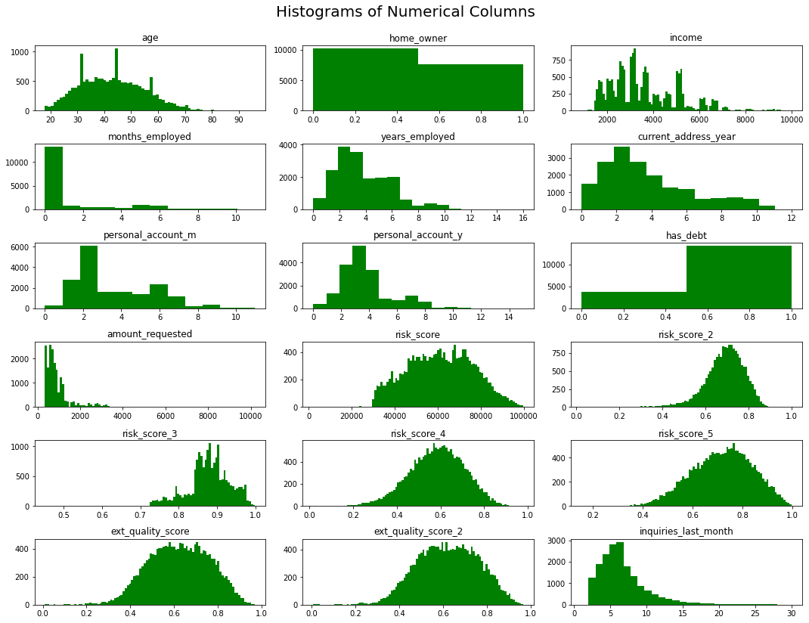
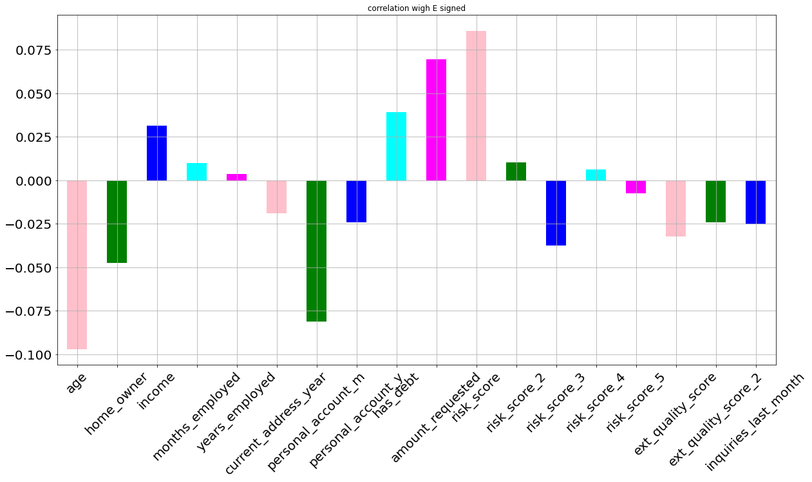
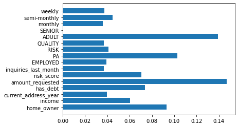

# E-signing-of-loan-by-Machine-Learning
E-signing of loan based on financial history using various Machine Learning Model
ESignature:

Electronic signatures aren’t exactly a novelty. They have been around since the American Civil War, during which contracts were signed through Morse. In a modern setting, an e-Sign refers to a unique, digitised, encrypted personal identifier. This is, in essence, different from the ‘wet’ signatures created by hand. The e-Sign is meant to complete transactions, loops, and agreements electronically.

In India, the e-Sign has been granted legal status by amendments to various laws, namely the Information Technology Act, Indian Evidence Act and the Negotiable Instruments Act. Early adopters in the financial sector have started using e-Sign to get customers to sign loan and card applications, and loan agreements.

EDA

Models implemented:

Artificial Neural Network

Random Forest Classifier

Gradient Boosting

Support Vector Machine

Xg Boost

Logistic Regression

Feature Importance

Observation
XgBoost Algorithm performs the best and give the accuracy of 64 %
We see that the ANN with no feature engineering performs far better than SVM, Random Forest with feature engineering
Though we didnt get very high accuracy but this can help the banks in knowing whether the customer is risky or not.

